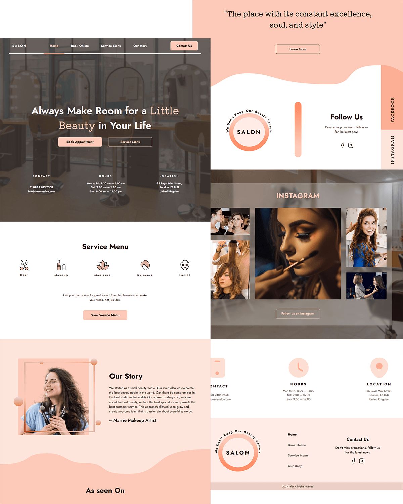

# Beauty Salon Website

A responsive website for a beauty salon, designed using a desktop layout. You can explore the live demo [here on Netlify](https://).

### Pages

- **Home**: The landing page with a brief introduction to the salon.
- **Book Online**: A four-step booking form. Please note that while you can fill out the form, **the data is not actually sent anywhere** (it's only an imitation for demonstration purposes).
- **Service Menu**: A list of available services with a sticky navbar, allowing users to filter services by category.
- **Our Story**: A page that tells the story of the salon, including its mission and values.
- **Contact Us**: Contact details and a form for inquiries.
- **404**: A custom 404 page for navigation errors.

### Development Tools & Technologies

- [React](https://react.dev/): JavaScript library for building user interfaces.
- [Vite](https://vite.dev/guide/): A fast and modern build tool for React applications.
- [React Router](https://reactrouter.com/en/main): A library for navigation and routing within the app.
- [Styled Components](https://styled-components.com/): A CSS-in-JS library for styling components in a modular way.
- [React Calendar](https://www.npmjs.com/package/react-calendar): A calendar component.
- [Animate On Scroll](https://michalsnik.github.io/aos/): A library to add animations when elements are scrolled into view.

### Features

- **Responsive Design**: The website adapts to various screen sizes, providing a great user experience on both desktop and mobile devices.
- **Booking Form**: Simulated multi-step booking process for users to easily book appointments.
- **Sticky Services Navigation**: The service menu features a sticky navbar to help users quickly jump to different service categories.
- **Smooth Animations**: Elements animate as they enter the viewport, providing a more dynamic browsing experience.
- **Wave Animation**: Custom animated SVG waves, created by me, providing a dynamic and fluid background effect.

### Screenshot

